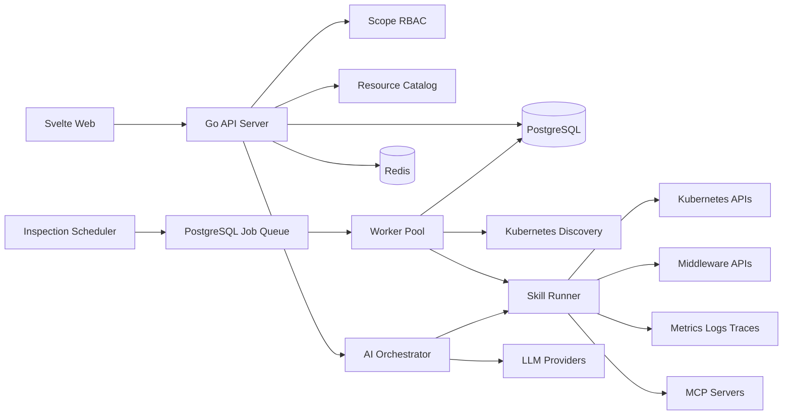

# OpsKeeper 总体架构设计

## 1. 建设目标

OpsKeeper 以业务项目为最终运维对象，以团队为基础设施和共享中间件的管理边界，以平台为公共能力和治理边界，为线上服务提供资源管理、自动发现、智能诊断、自动巡检和运维审计能力。

平台重点管理：

- 部署在 Kubernetes 上的业务应用和工作负载。
- 部署在任意环境中的 PostgreSQL、Redis、Kafka 等中间件。
- Prometheus、Loki、Tempo、Elastic 等外部可观测平台。
- LLM Provider、模型、MCP Server、Skill 等 AI 运维能力。
- 平台、团队和项目三级用户、角色及授权关系。

首版按单平台部署设计，数据模型预留 `tenant_id`，但不在首版暴露多租户能力。

## 2. 组织层级

```text
Platform
├── Team A
│   ├── Project A1
│   └── Project A2
└── Team B
    └── Project B1
```

- 平台：全局治理边界，承载公共 Skill、模型、监控平台和平台管理员。
- 团队：人员及基础设施共享边界，通常拥有独立 Kubernetes 集群、共享中间件和监控数据源。
- 项目：业务系统边界，承载业务应用、服务、工作负载及其依赖关系。
- 一个项目只能直属一个团队。资源归属层级由资源实例的共享范围决定，而不是由资源类型硬编码决定。

## 3. 总体架构



## 4. 技术架构

| 层次 | 技术选型 | 说明 |
|---|---|---|
| 前端 | Svelte 5、TypeScript、Vite、TanStack Query | 管理控制台和流式诊断工作台 |
| 后端 | Go、`chi`、`pgx`、`sqlc`、`client-go` | REST API、资源发现和运维编排 |
| 数据库 | PostgreSQL 16 | 业务数据、资源拓扑、任务、证据、审计 |
| 缓存 | Redis 7 | 缓存、限流、短期状态和分布式锁 |
| 实时交互 | SSE | 推送诊断过程、工具调用和巡检进度 |
| 可观测性 | OpenTelemetry | 平台自身日志、指标和链路 |
| 部署 | Kubernetes、Helm、Ingress | API 和 Worker 均可水平扩容 |

持久任务以 PostgreSQL Job 表和 `FOR UPDATE SKIP LOCKED` 实现，确保 Redis 故障不会造成任务丢失。规模增长后可将任务引擎替换为 Temporal。

## 5. 后端模块

首版采用模块化单体和独立 Worker，不提前拆分微服务：

| 模块 | 核心职责 |
|---|---|
| Identity | 用户、用户组、登录和身份同步 |
| Organization | 平台、团队、项目及成员关系 |
| Authorization | 三级 RBAC、权限继承和数据范围校验 |
| Resource Catalog | 资源、凭据、关系、标签、状态和拓扑查询 |
| Discovery | Kubernetes 发现、差异预览、导入和周期同步 |
| Connector | Kubernetes、中间件、监控平台和 LLM Provider 适配 |
| Skill Registry | Skill 定义、版本、能力要求和权限声明 |
| AI Orchestrator | 上下文构建、Skill 选择、工具编排和证据归纳 |
| Diagnosis | 对话会话、消息、工具调用、假设和诊断报告 |
| Inspection | 巡检策略、调度、执行、评分和异常项 |
| Notification | Webhook、邮件及其他通知渠道 |
| Audit | 管理操作、模型调用、工具调用和审批记录 |

后端代码默认按业务特性组织。每个特性包拥有自身的类型、业务规则、持久化实现和测试，并在同包内通过文件划分职责；不会把所有业务的数据库实现集中到全局 adapter 层。数据库连接生命周期、缓存客户端、消息传输和外部平台协议等真正跨特性的能力，才建立独立基础设施包。

包之间优先直接依赖清晰的具体类型。只有消费者需要测试替身、已经存在多个真实实现或边界需要稳定契约时，才定义小接口；不要求所有模块机械地通过接口调用。耗时任务进入 Worker，普通资源查询和管理请求由 API Server 直接处理。

完整约束见 [Go 编码与工程组织通用规范](go-coding-conventions.md)。

## 6. 前端信息架构

| 页面 | 主要能力 |
|---|---|
| 平台总览 | 全局健康状态、异常趋势、团队分布和任务状态 |
| 团队工作台 | 团队资源、集群、中间件、项目及共享关系 |
| 项目工作台 | 应用拓扑、依赖、诊断入口、巡检结果和负责人 |
| 资源中心 | 按平台/团队/项目范围浏览、创建、测试和同步资源 |
| 集群导入 | Namespace 扫描、项目映射、资源预览和确认导入 |
| AI 诊断 | 流式对话、资源选择、执行时间线、证据和审批 |
| Skill 中心 | Skill 版本、适用目标、工具权限和测试记录 |
| 巡检中心 | 策略、执行历史、异常、健康评分和通知 |
| 权限中心 | 平台、团队、项目角色和成员授权 |
| 审计中心 | 登录、资源变更、诊断、工具执行和审批日志 |

用户进入团队或项目后，前端必须显示当前作用域，所有资源选择器默认限定在当前作用域可见范围内。

## 7. 核心 API 边界

```text
/api/v1/platform/resources
/api/v1/teams/{teamId}/resources
/api/v1/teams/{teamId}/projects
/api/v1/projects/{projectId}/resources
/api/v1/resources/{resourceId}/relations
/api/v1/kubernetes-clusters/{id}/discoveries
/api/v1/discoveries/{id}/imports
/api/v1/diagnosis-sessions
/api/v1/diagnosis-sessions/{id}/events
/api/v1/inspection-policies
/api/v1/inspection-runs
/api/v1/skills
/api/v1/role-bindings
/api/v1/audit-logs
```

资源 ID 不代表访问权限。每个读取和写入请求都必须根据资源的实际作用域重新执行授权判断，禁止仅依赖前端或 URL 中的团队、项目参数。

## 8. 部署与可靠性

- Web 静态资源可由独立容器或对象存储/CDN 提供。
- API Server 无状态部署，生产环境至少两个副本。
- Scheduler 使用 PostgreSQL advisory lock 保证单一调度主节点。
- Worker 使用任务租约、心跳和幂等键恢复中断任务。
- 外部调用统一实施超时、限流、重试、熔断和最大响应体限制。
- PostgreSQL 开启备份、PITR 和高可用；Redis 只承载可恢复数据。
- 诊断、巡检和工具执行保存输入摘要、证据、版本和结果，支持复现。
- 数据库迁移由滚动发布前的单实例 Migration Job 执行，使用 PostgreSQL advisory lock 防止并发；应用进程不自动迁移，Schema 演进遵循 Expand/Contract。

### 数据库权限边界

- PostgreSQL Cluster 管理员与 OpsKeeper 业务数据库所有者必须是不同角色。管理员负责实例、角色和数据库生命周期，业务角色只拥有应用数据库，不具备超级用户、创建数据库或创建角色权限。
- 容器首次初始化时，`POSTGRES_*` 只定义基础设施管理员和管理连接数据库，`OPSK_DB_*` 由项目初始化脚本用于创建受限的业务角色和业务数据库。
- API、Worker、Scheduler 和数据库迁移只允许使用业务角色连接，不得注入或回退使用 PostgreSQL 超级用户凭据。
- 初始化环境变量和 `/docker-entrypoint-initdb.d/` 脚本只对空数据目录生效；已有实例的角色、密码和所有权变更必须通过受控的数据库管理操作完成。

数据库迁移和自动化发布的完整流程见[数据库与应用自动化发布](delivery.md)。

## 9. 建议交付阶段

1. 组织、资源、关系、三级 RBAC 和审计基础。
2. Kubernetes 集群发现、Namespace 到项目的导入及资源同步。
3. LLM Provider、诊断会话及 Kubernetes/PostgreSQL/Redis Skill。
4. 指标、日志、链路 Connector 和自动巡检。
5. MCP、自定义 Skill 沙箱、人工审批和有限自动处置。
