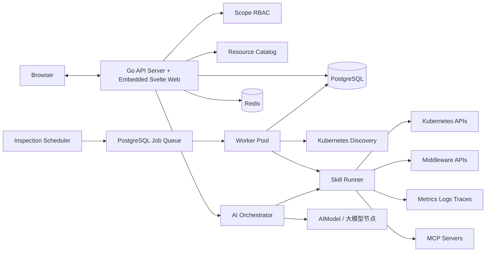

# OpsKeeper 总体架构设计

## 文档状态

本文同时维护已经验收的架构事实和已经确定的目标边界，但二者必须明确区分：

- **当前实现**：截至最近一次已完成任务，仓库中已经存在并通过验收的能力；T15 已实现但仍等待真实 Kubernetes 环境验收的内容会单独标注。
- **目标设计**：尚未实现的设计约束，必须标注对应任务编号；任务获批前不代表已经交付。
- 任务状态、实施细节和验收边界以对应迭代目录中的 `iteration.md`、需求文档和需求验收报告为准；I001 的历史记录见 [I001 封板说明](../iterations/archived/I001-initial/iteration.md)。

## 1. 建设目标

OpsKeeper 以业务项目为最终运维对象，以团队为基础设施和共享中间件的管理边界，以平台为公共能力和治理边界，为线上服务提供资源管理、自动发现、智能诊断、自动巡检和运维审计能力。

平台重点管理：

- 部署在 Kubernetes 上的业务应用和工作负载。
- 部署在任意环境中的 PostgreSQL、Redis、Kafka 等中间件。
- Prometheus、Loki、Tempo、Elastic 等外部可观测平台。
- AIModel（内部包含大模型节点 LLMEndpoint）、MCP Server、Skill 等 AI 运维能力。
- 平台、团队和项目三级用户、角色及授权关系。

首版按单平台部署设计，数据模型预留 `tenant_id`，但不在首版暴露多租户能力。

## 2. 组织层级

```text
Platform
├── Team A
│   ├── Project A1
│   └── Project A2
└── Team B
    └── Project B1
```

- 平台：全局治理边界，承载公共 Skill、模型、监控平台和平台管理员。
- 团队：人员及基础设施共享边界，通常拥有独立 Kubernetes 集群、共享中间件和监控数据源。
- 项目：业务系统边界，承载业务应用、服务、工作负载及其依赖关系。
- 一个项目只能直属一个团队。资源归属层级由资源实例的共享范围决定，而不是由资源类型硬编码决定。

## 3. 目标总体架构

下图描述当前系统形态。Browser、嵌入式 Web、Go API、PostgreSQL、Redis、组织与授权、资源目录、发现、Connector、诊断、巡检、MCP、受控执行和审批均已实现；T15 的生产部署与可观测配置已经入库，仍需在干净 Kubernetes 环境完成部署验收。



## 4. 技术架构

| 层次 | 技术选型 | 状态 | 说明 |
|---|---|---|---|
| 前端基础 | Svelte 5、TypeScript、Vite | 已实现，T01-T14 | 独立开发，生产时嵌入 Go API |
| 前端数据访问 | 类型化 API 客户端 | 已实现，T07-T14 | 统一处理 base path、会话刷新和结构化错误；查询库按实际复杂度引入 |
| 后端基础 | Go、`chi`、`pgx` | 已实现，T01-T15 | REST API、健康检查、迁移和模块化业务能力 |
| 查询生成 | `sqlc` | 候选，按真实复杂度引入 | 不作为所有 Store 的强制前置条件 |
| Kubernetes 客户端 | `client-go` | 已实现，T08 | 集群发现、Project/Application 导入 |
| Agent 与 Runner | Google ADK Go `v2.2.0` | 已实现，T10-T14 | `llmagent`、Runner 和 Function Tool 为执行内核；外层保留 OpsKeeper 权限、预算、审批和审计 |
| OpenAI-compatible | 项目内 Chat Completions Adapter | 已实现，T10 | 实现 ADK `model.LLM`，支持文本、SSE、usage 和 Tool Calling；来源归属见根目录 `THIRD_PARTY_NOTICES.md` |
| MCP | Model Context Protocol 官方 Go SDK | 已实现，T14 | MCP 连接、能力发现和 Tool 调用，不自行实现协议栈 |
| 数据库 | PostgreSQL 16 | 已实现，T01-T15 | 保存组织、身份、授权、审计、资源、诊断、巡检、审批和任务数据 |
| 缓存 | Redis 7 | 已接入健康检查；业务用途未实现 | 目标用于缓存、限流和可恢复短期状态 |
| 实时交互 | SSE | 已实现，T11 | 推送诊断过程和工具调用事件 |
| 日志 | `slog` + 项目日志 Handler（`json`/`text`/`raw`） | 规范已确定，待统一接入 | 全部 Go 进程遵循[后端日志规范](../standards/backend-logging.md) |
| 指标和链路 | OpenTelemetry OTLP/HTTP | 已实现，T15，待环境验收 | HTTP 链路以及任务、Connector、LLM Token 和错误等低基数指标；未配置端点时本地无外部依赖 |
| 本地部署 | Docker Compose | 已实现，T01 | PostgreSQL 和 Redis 开发环境 |
| 生产部署 | 单镜像、Kubernetes、Helm、Ingress | Chart 已实现，T15，待干净集群验收 | API、Worker 可独立扩容；Scheduler 单副本；Migration 使用发布前 Hook |

目标任务模型使用 PostgreSQL Job 表和 `FOR UPDATE SKIP LOCKED`，确保 Redis 故障不会造成任务丢失，在 T10-T13 实施。规模确实超过数据库任务队列边界后，再评估 Temporal，不将其作为当前预设依赖。

## 5. 后端模块

首版采用模块化单体和独立 Worker，不提前拆分微服务：

| 模块 | 核心职责 | 状态 |
|---|---|---|
| Organization | 平台、团队、项目及 Scope 关系 | 已实现，T02；T08 增加 Kubernetes 来源信息 |
| Identity | 用户、凭据、登录、会话和用户管理 | 已实现，T03-T05 |
| Authorization | 三级 Scope RBAC、资源角色、权限继承和数据范围校验 | 已实现，T04-T05；T08 增加具体资源授权 |
| Resource Catalog | 资源、凭据、关系、标签、状态和拓扑查询 | 已实现，T06-T08 |
| Discovery | Kubernetes 发现、项目映射、Application 导入和失联标记 | 已实现，T08；周期调度后续实现 |
| Connector | Kubernetes、Prometheus、Loki 能力适配和连接检查 | 已实现并验收，T09；中间件和 AIModel 在后续目标设计中扩展 |
| Skill Registry | Skill 定义、不可变版本、Schema、工具白名单和风险级别 | 已实现，T10-T14；Markdown Skill 编辑体验见 OI-006 |
| AI Orchestrator | Scope 默认解析、受控 Tool Calling、预算、执行记录和高风险审批 | 已实现，T10-T14 |
| Diagnosis | 对话会话、消息、工具调用、证据和诊断报告 | 已实现，T11-T12 |
| Inspection | 巡检策略、调度、执行、评分和异常项 | 已实现，T13 |
| Notification | HTTPS Webhook、签名、限流、重试和投递记录 | 已实现，T13；邮件等渠道后续扩展 |
| Audit | 管理操作、模型调用、工具调用、审批和保留记录 | 已实现，T05-T15；敏感字段脱敏，普通角色不能修改或删除，清理要求先导出并记录批次 |

后端代码默认按业务特性组织。每个特性包拥有自身的类型、业务规则、持久化实现和测试，并在同包内通过文件划分职责；不会把所有业务的数据库实现集中到全局 adapter 层。数据库连接生命周期、缓存客户端、消息传输和外部平台协议等真正跨特性的能力，才建立独立基础设施包。

包之间优先直接依赖清晰的具体类型。只有消费者需要测试替身、已经存在多个真实实现或边界需要稳定契约时，才定义小接口；不要求所有模块机械地通过接口调用。耗时任务进入 Worker，普通资源查询和管理请求由 API Server 直接处理。

完整约束见 [Go 编码与工程组织通用规范](../standards/go-coding-conventions.md)。

## 6. 目标前端信息架构

当前前端已实现登录、三级 Scope 导航、组织、资源、成员与角色、资源关系、拓扑、Kubernetes 集群导入、AI 诊断、Skill、巡检、审批和审计页面。

| 页面 | 主要能力 |
|---|---|
| 平台总览 | 全局健康状态、异常趋势、团队分布和任务状态 |
| 团队工作台 | 团队资源、集群、中间件、项目及共享关系 |
| 项目工作台 | 应用拓扑、依赖、诊断入口、巡检结果和负责人 |
| 资源中心 | 按平台/团队/项目范围浏览、创建、测试和同步资源 |
| 集群导入 | Namespace 扫描、项目映射、资源预览和确认导入 |
| AI 诊断 | 流式对话、资源选择、执行时间线、证据和审批 |
| Skill 中心 | Skill 版本、适用目标、工具权限和测试记录 |
| 巡检中心 | 策略、执行历史、异常、健康评分和通知 |
| 权限中心 | 平台、团队、项目角色和成员授权 |
| 审计中心 | 登录、资源变更、诊断、工具执行和审批日志 |

用户进入团队或项目后，前端必须显示当前作用域，所有资源选择器默认限定在当前作用域可见范围内。

## 7. 核心 API 边界

所有公开页面、健康检查和业务 API 统一挂载在 `OPSK_BASE_PATH` 下，默认值是 `/opskeeper`，也可以设置为根路径 `/`。以下示例使用默认值：

当前已实现健康检查、身份、组织、授权、资源、凭据、关系、拓扑和 Kubernetes 发现 API。后续 API 按任务逐步增加：

| 路径示例 | 状态 |
|---|---|
| `/opskeeper/health/live`、`/opskeeper/health/ready` | 已实现，T01 |
| `/opskeeper/api/v1/teams`、`/opskeeper/api/v1/teams/{teamId}/projects` | 已实现，T02 |
| `/opskeeper/api/v1/auth/login`、`/opskeeper/api/v1/auth/refresh`、`/opskeeper/api/v1/auth/logout`、`/opskeeper/api/v1/auth/me` | 已实现，T03 |
| `/opskeeper/api/v1/users`、`/opskeeper/api/v1/groups`、`/opskeeper/api/v1/roles`、`/opskeeper/api/v1/role-bindings`、`/opskeeper/api/v1/audit-logs` | 已实现基础管理能力，T05 |
| `/opskeeper/api/v1/resources`、`/opskeeper/api/v1/resources/{resourceId}/relations`、`/opskeeper/api/v1/resources/{resourceId}/topology` | 已实现，T06 |
| `/opskeeper/api/v1/resources/{id}/discoveries`、`/opskeeper/api/v1/discoveries/{id}/imports` | 已实现，T08 |
| `/opskeeper/api/v1/resource-roles`、`/opskeeper/api/v1/resource-role-bindings` | 已实现，T08 |
| `/opskeeper/api/v1/resources/{id}/connection-tests`、`/opskeeper/api/v1/resources/{id}/connection-tests/latest` | 已实现并验收，T09 |
| `/opskeeper/api/v1/diagnosis-sessions`、`/opskeeper/api/v1/diagnosis-sessions/{id}/events` | 已实现，T11 |
| `/opskeeper/api/v1/inspection-policies`、`/opskeeper/api/v1/inspection-runs` | 已实现，T13 |
| `/opskeeper/api/v1/skills/{id}/versions`、`/opskeeper/api/v1/skill-defaults`、`/opskeeper/api/v1/skill-executions` | 已实现，T10 |
| `/opskeeper/api/v1/ai-models`、`/opskeeper/api/v1/ai-models/{id}/test` | 目标设计；替代历史 LLM Provider 接口 |

资源 ID 不代表访问权限。每个读取和写入请求都必须根据资源的实际作用域重新执行授权判断，禁止仅依赖前端或 URL 中的团队、项目参数。

## 8. 部署与可靠性

### 当前实现

- 前后端源码和依赖保持独立；本地既可使用 Go API 与 Vite 分离热更新，也可通过 `make front-api-run` 构建并嵌入前端后只运行 API。生产构建同样将 Vite 静态制品嵌入 `opskeeper-api`，由一个进程提供页面、静态资源和业务 API。
- 应用临时运行、二进制构建和最终镜像打包统一由根目录 Makefile 提供入口，不使用独立包装脚本。
- API、Worker、Scheduler 和 Migration 的服务名称及镜像内二进制文件名固定为 `opskeeper-api`、`opskeeper-worker`、`opskeeper-scheduler` 和 `opskeeper-migrate`；`OPSK_BASE_PATH` 只控制 API 的 HTTP 路径前缀。
- API、Worker、Scheduler 和 Migration 的日志格式由 `OPSK_LOG_FORMAT` 统一控制，支持 `json`、`text` 和 `raw`，默认使用 `raw`；字段顺序、Trace/Span 和 ReqID 规则遵循[后端日志规范](../standards/backend-logging.md)。
- API 默认不信任客户端转发头；只有 `OPSK_TRUSTED_PROXIES` 明确列出的直连代理才能提供客户端 IP，解析结果写入请求日志并供后续审计使用。
- 数据库迁移由滚动发布前的单实例 Migration Job 执行，使用 PostgreSQL advisory lock 防止并发；应用进程不自动迁移，Schema 演进遵循 Expand/Contract。
- Connector 调用统一使用超时、全局并发、有限重试、查询范围和最大响应大小限制；连接检查只持久化安全分类、公开消息、耗时和能力，不保存上游响应正文或凭据。
- T15 Helm Chart 已包含 API、Worker、Scheduler、Migration Hook、探针、资源限制、非 root 安全上下文、PDB、可选 HPA 和 NetworkPolicy；Chart 不生成或接管运行时 Secret。
- API 在生产环境启用 HSTS，并统一设置 CSP、点击劫持与内容嗅探防护、Permissions Policy；状态变更请求经过 Origin/Fetch Metadata 校验，并有 CORS、请求体上限和按客户端 IP 的进程内限流。
- API、Worker、Scheduler 和 Migration 可通过 OTLP/HTTP 导出链路与指标；审计事件及保留批次采用数据库追加写保护，保留清理必须携带已验证导出引用和变更单。
- 生产配置拒绝开发数据库/Redis 默认地址、不安全 Cookie 以及非 HTTPS 跨域 Origin。

### 目标设计

- API Server 保持无状态，Chart 默认两个副本；真实环境副本可用性仍需在 T15 集群验收确认。
- Scheduler 在 T13 使用 PostgreSQL advisory lock 保证单一调度主节点。
- Worker 在 T10-T13 使用任务租约、心跳和幂等键恢复中断任务。
- Connector 熔断和按目标隔离的配额在真实负载出现后评估；当前已经具备超时、全局并发、有限重试、查询范围和最大响应大小限制。
- PostgreSQL 备份、PITR 和高可用由部署环境提供，仓库提供恢复 Runbook；恢复目标和演练结果必须由每个生产环境单独验收。
- 诊断、巡检和工具执行保存输入摘要、证据、版本和结果，支持复现。

### 数据库权限边界

- PostgreSQL Cluster 管理员与 OpsKeeper 业务数据库所有者必须是不同角色。管理员负责实例、角色和数据库生命周期，业务角色只拥有应用数据库，不具备超级用户、创建数据库或创建角色权限。
- 容器首次初始化时，`POSTGRES_*` 只定义基础设施管理员和管理连接数据库，`OPSK_DB_*` 由项目初始化脚本用于创建受限的业务角色和业务数据库。
- API、Worker、Scheduler 和数据库迁移只允许使用业务角色连接，不得注入或回退使用 PostgreSQL 超级用户凭据。
- 初始化环境变量和 `/docker-entrypoint-initdb.d/` 脚本只对空数据目录生效；已有实例的角色、密码和所有权变更必须通过受控的数据库管理操作完成。

数据库迁移和自动化发布的完整流程见[自动化发布](../guides/delivery.md)。

## 9. 交付阶段

交付顺序、审批状态和验收标准统一维护在对应迭代文档，本文不再维护另一套阶段编号。
