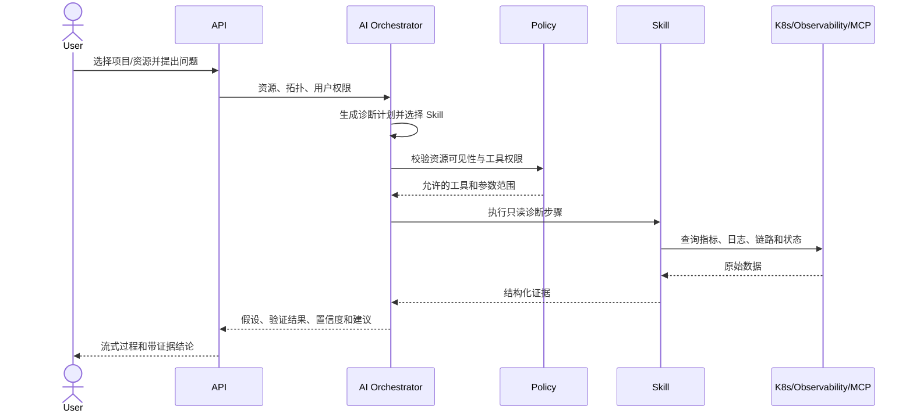

# Kubernetes 导入、AI 诊断与自动巡检

## 1. Kubernetes 集群导入

Kubernetes 集群可以归属平台、团队或项目，但导入行为受其作用域约束：

| 集群作用域 | 典型场景 | 导入规则 |
|---|---|---|
| 平台级 | 公共基础设施或共享集群 | Namespace 可映射到任意团队下的项目，必须显式选择团队 |
| 团队级 | 团队独立集群 | Namespace 只能创建或映射到当前团队项目 |
| 项目级 | 项目独享集群 | 发现的业务资源只能导入当前项目，不自动创建其他项目 |

导入流程：

```text
登记 Kubernetes → 扫描 Namespace 和工作负载
→ 生成 Project 映射与 Application 候选
→ 用户确认 → 幂等导入 → 后续按任务引入周期同步
```

团队级集群是默认场景。每个非系统 Namespace 默认建议对应一个项目；用户可以选择新建项目、映射已有项目或忽略。

Kubernetes 集群本身登记为 `Kubernetes` 资源，保存 API 连接配置并关联加密 kubeconfig。Namespace 不登记为资源，而是映射到已有或新建 Project。Deployment、StatefulSet、DaemonSet、Job 和 CronJob 统一映射为 Project 下的 `Application`，其原始类型保存在 `kubernetes.workload_kind`。

Pod 不登记为资源，每个 Pod 副本作为 Application 的一个 `Instance`；Service、Ingress 和 EndpointSlice 同样不登记为资源，其端口、访问入口和地址聚合在 Application 配置字段中。由此，页面、AI 问答、诊断和巡检围绕 Project 与 Application 展开，而不是让用户维护 Kubernetes 内部对象目录。

根据环境变量、ConfigMap、Service DNS 和连接地址推断出的中间件依赖仅作为候选关系，必须人工确认。平台禁止读取或导入 Kubernetes Secret 明文。

## 2. 发现与同步

```text
discovery_runs {
  id, cluster_resource_id, status,
  started_at, completed_at, item_count, imported_count, error_message
}

discovery_items {
  id, run_id, kind, namespace,
  external_uid, resource_version,
  labels, payload, status,
  imported_project_id, imported_resource_id
}
```

导入使用 Kubernetes UID 作为 `external_uid`，并结合来源 Kubernetes 资源、目标 Scope 和资源类型保证幂等。对于删除或失联的 Application，当前先标记 `unknown`，不自动删除；宽限期归档和周期调度属于后续任务。

## 3. 外部监控平台

Prometheus、Loki、Tempo、Elastic 等同样作为资源存在，可以位于任意作用域。业务应用通过 `observed_by` 关系选择可观测数据源。

Connector 对 Skill 提供统一能力：

```text
query_metrics(query, start, end, step)
query_logs(filter, start, end, limit)
query_traces(service, operation, start, end)
get_alerts(target, time_range)
```

应用可以关联多个平台，例如平台级 Prometheus、团队级 Loki 和项目级 Tempo。解析时使用显式关联，不按名称猜测数据源。

## 4. Skill 模型

Skill 本身是资源，支持平台、团队、项目三级归属和版本管理：

```text
SkillManifest {
  name, version,
  supported_resource_kinds,
  required_capabilities,
  input_schema,
  tools,
  permissions,
  timeout,
  risk_level,
  prompt_template,
  result_schema
}
```

建议内置平台级 Skill：

- Kubernetes Workload、Pod、事件、调度、探针、资源限制和发布诊断。
- PostgreSQL 连接、慢查询、锁、复制和容量诊断。
- Redis 内存、热 Key、慢命令、连接和主从诊断。
- Kafka 消费积压、ISR、分区和 Broker 健康诊断。
- 指标异常、日志聚类、Trace 延迟和跨资源关联分析。

团队可以基于自身环境创建扩展 Skill，项目可以创建面向特定业务的 Runbook Skill。项目 Skill 可使用本项目、所属团队和平台提供的资源及工具。

## 5. AI 诊断流程



诊断上下文包括当前资源、允许访问的上下级资源、依赖拓扑、近期变更、告警、指标、日志、链路和历史巡检结果。

每个诊断结论必须包含证据 ID、来源、采集时间、时间范围和相关资源。证据不足时只能输出待验证假设，不能输出确定性根因。

外部日志、网页、MCP 响应和资源注解均视为不可信输入，不允许其中的文本修改系统指令或提升工具权限。

## 6. 对话交互

诊断会话必须绑定一个起始作用域和至少一个目标资源。用户在对话中增加目标时重新执行权限校验。

前端流式展示：

- 当前诊断计划和阶段。
- 已调用的 Skill 与工具，不展示敏感参数。
- 正在采集的指标、日志或链路时间范围。
- 诊断假设、支持和反对证据。
- 最终结论、置信度、影响范围和建议操作。
- 需要用户确认的高风险操作。

## 7. 自动巡检

巡检策略包含：

```text
scope, target_selector, schedule, timezone,
skill_set, provider, maintenance_windows,
concurrency, timeout, retries,
notification_channels, cost_budget
```

平台、团队和项目均可创建巡检策略：

- 平台策略用于公共服务或治理基线。
- 团队策略用于集群和团队共享中间件。
- 项目策略用于业务应用和项目依赖。

策略只能选择其作用域可见的目标。上级策略如需覆盖下级资源，创建者必须拥有相应下级范围的巡检权限。

执行链路：

```text
调度 → 解析目标 → 快照资源拓扑 → 确定性检查
→ 异常时调用 AI/Skill → 生成 Finding → 去重聚合
→ 更新健康评分 → 通知 → 保存报告和证据
```

优先执行规则、查询和阈值检查，仅在异常、关联分析或解释阶段调用 LLM，以控制成本并提高稳定性。

## 8. 巡检结果和健康评分

一次巡检输出健康评分、异常项、影响资源、证据、原因假设、处置建议、与上次执行的差异和模型用量。

健康评分由确定性信号计算，LLM 只能解释或建议，不能直接决定分数。异常项以目标、规则、时间窗口生成指纹，避免周期巡检重复制造相同事件。

执行状态：

```text
scheduled → running → collecting → analyzing
          → succeeded | warning | failed | cancelled
```

任务采用至少一次执行语义，通过执行幂等键避免生成重复报告或通知。

## 9. MVP 验收范围

首个可用版本建议覆盖：

1. 平台、团队、项目管理和三级内置角色。
2. 任意资源类型的三级归属、可见性和关系校验。
3. 团队级 Kubernetes 集群导入及 Namespace 到项目的映射。
4. Kubernetes、PostgreSQL、Redis、Prometheus、Loki 资源接入。
5. 基于只读 Skill 的流式诊断和证据引用。
6. 项目级及团队级周期巡检、报告、异常去重和 Webhook 通知。
7. 凭据加密、工具权限限制和完整审计日志。
